# РОССИЙСКИЙ УНИВЕРСИТЕТ ДРУЖБЫ НАРОДОВ
## Факультет физико-математических и естественных наук
### Кафедра прикладной информатики и теории вероятностей

...

## ОТЧЕТ ПО ЛАБОРАТОРНОЙ РАБОТЕ №3 Markdown

...
### *дисциплина: "Операционные системы"*

...

**Студент: Ким Реачна**
**Группа: НПИбд-02-20**

...
**Moscow**
**2021г.**

#### Цель работы:
Изучить идеологию и применение средств контроля версий.
#### Выполнение работы:
1. Создаем учетную запись Github

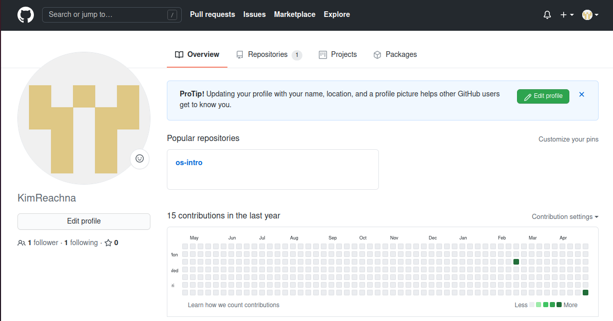

2. Создадим локальный репозиторий, Сначала сделаем предварительную конфигурацию, указав имя и email владельца репозитория:
git config --global user.name "Имя фамилия"
git config --global user.email "work@email"

3. Для последующей идентификации пользователя на сервере репозиториев необходимо сгенерировать пару ключей (приватный и открытый):
ssh-keygen -C "Имя фамилия < work@mail >"

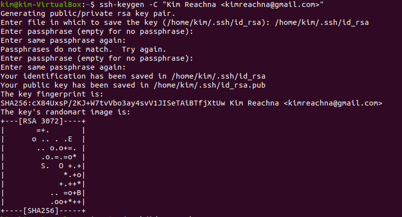

4. Откройте настройки -> SSH в github и скопируйте текст и вставьте его:

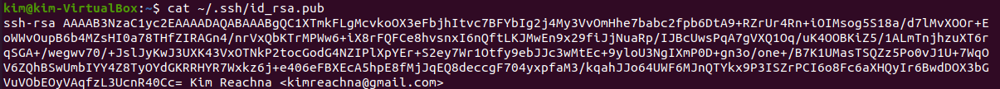
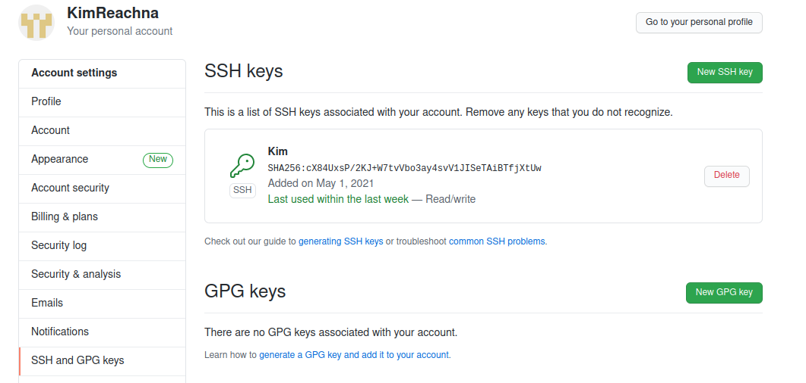

5. Создаем репозиторий на Github, назовем его os-intro:

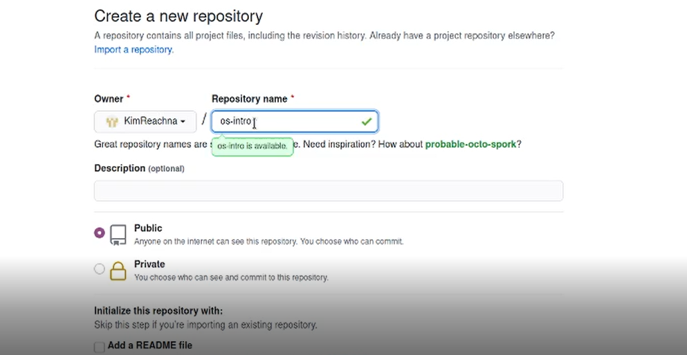

6. Перехожу в каталог laboratary используя команду cd < полный путь до каталога > и инициализирую системы git:

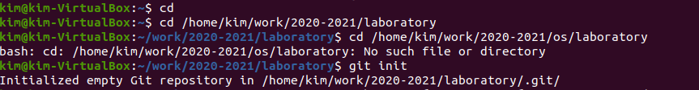

7.	Создаём заготовку для файла README.md:

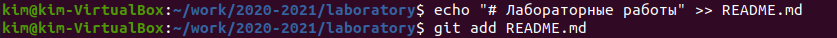

8.	Делаем первый коммит и выкладываем на github:

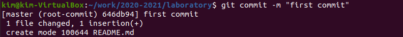
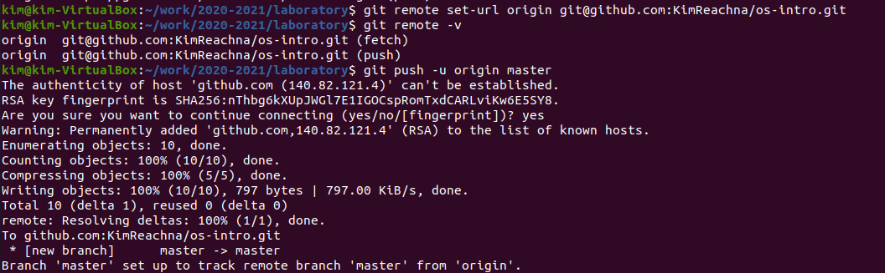

9. Добавим файл лицензии:

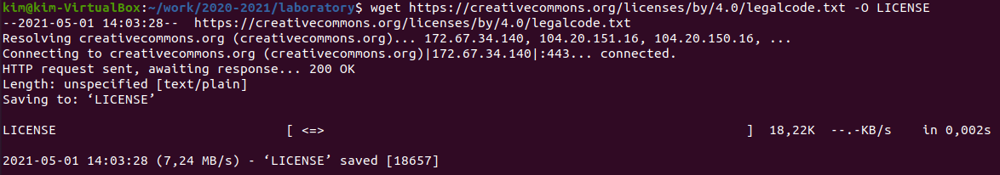

10. Добавим шаблон игнорируемых файлов. Просмотрим список имеющихся шаблонов:

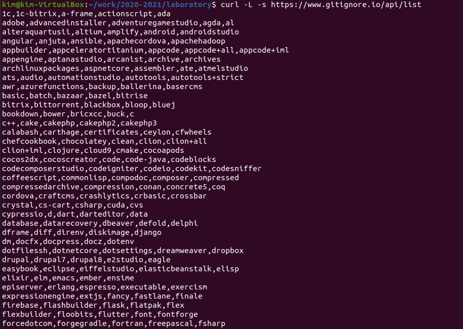

11. Добавим новые файлы , Выполним коммит:

12. Отправим на github:
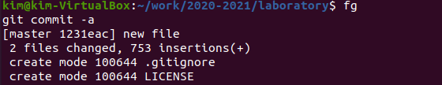
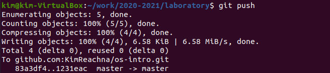

13.	 Инициализируем git-flow , Префикс для ярлыков установим в v:

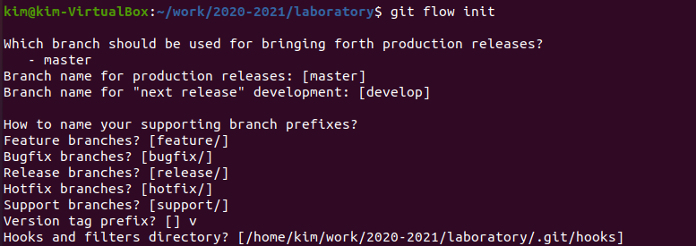

14.	 Проверьте на ветке develop:

15. Создадим релиз с версией 1.0.0:

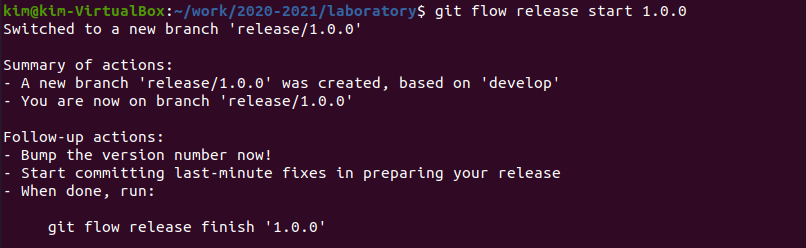

16.	 Запишем версию, Добавим в индекс:

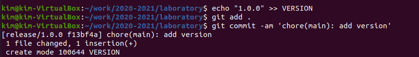

17. Зальём релизную ветку в основную ветку:

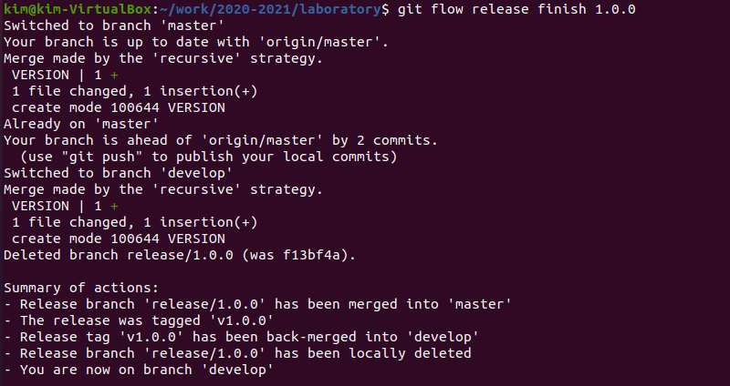

18. Отправим данные на github^

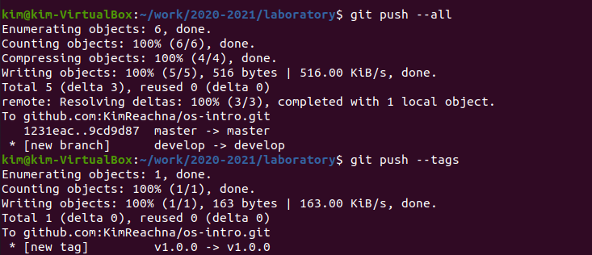

#### Контрольные вопросы:

1. Системы контроля версий (VCS) - программное обеспечение для облегчения работы с изменяющейся информацией, позволяющее хранить несколько версий одного и того же документа, при необходимости возвращаться к более ранним версиям.
Предназначены для работы нескольких человек над одним проектом, а также при разработке программного обеспечения для хранения исходных кодов разрабатываемой программы.

2. Хранилище – место «памяти», в котором будет храниться новая версия файла после его изменения пользователем.
Commit. В нем содержится описание тех изменений, которые вносит пользователь в код приложения.
История –история изменений. Обычно доступна информация о том, кто из участников, когда и какие изменения вносил. 
Рабочая копия – это копия, которую мы выписали в свою рабочую зону, это то, над чем мы работаем в данный момент. Привилегированный доступ только одному пользователю, работающему с файлом.

3. Централизованные VCS предполагают наличие единого репозитория для хранения файлов. Выполнение большинства функций по управлению версиями осуществляется специальным сервером. Пример: AccuRev
Децентрализованные VCS не имеют единого репозитория, он у каждого пользователя свой. Помимо того, они были созданы для обмена изменениями, а не для их объединения. Не имеют какой-то жестко заданной структуры репозиториев с центральным сервером. Пример: Git

4. При единоличной работе с VCS каждое новое изменение в репозитории  сохраняется не со всеми предыдущими версиями. Оно изменяется по системе: одно предыдущее + новая информация.

5. Для начала те действия, что совершаются один раз:
      1. Создать репозиторий.
      Это место, где будут лежать файлы. Теперь у нас есть общее хранилище    данных, с которым и будет проходить дальнейшая работа.
      2. Скачать проект из репозитория.

Далее то, что будет использоваться в работе часто: 
- Обновить проект, забрать последнюю версию из репозитория
- Внести изменения в проект
- Запушить код, т.е изменить код в общем хранилище
- Создать ветку
Теперь, если нужно закоммитить изменения, они по-прежнему пойдут в основную ветку. Бранч при этом трогать НЕ будут. Так что мы можем смело коммитить новый код в trunk. А для показа использовать branch, который будет оставаться стабильным даже тогда, когда в основной ветке всё падает из-за кучи ошибок. С бранчами мы всегда будем иметь работающий код.

6.  -	Сохранение файлов с исходным кодом
     -	Защита от случайных исправлений и удалений
     -	Отмена изменений и удалений, если они оказались некорректными
     - 	Одновременная поддержка рабочей версии и разработка новой
     - 	Возврат к любой версии кода из прошлого
     -	Просмотр истории изменений
     -	Совместная работа без боязни потерять данные или затереть чужую работу

7. git init – создание основного дерева репозитория
git pull – получение обновлений (изменений) текущего дерева из центрального репозитория
git push – отправка всех произведённых изменений локального дерева в центральный репозиторий
git status – просмотр списка изменённых файлов в текущей директории
git diff – просмотр текущих изменений
git add – добавить все изменённые и/или созданные файлы и/или каталоги
git add имена_файлов – добавить конкретные изменённые и/или созданные файлы и/или каталоги
git rm имена_файлов – удалить файл и/или каталог из индекса репозитория
git commit -am 'Описание коммита' – сохранить все добавленные изменения и все изменённые файлы
git commit – сохранить добавленные изменения с внесением комментария через встроенный редактор
git checkout -b имя_ветки – создание новой ветки, базирующейся на текущей:
git checkout имя_ветки – переключение на ветку
git push origin имя_ветки – отправка изменений конкретной ветки в центральный репозиторий
git merge --no-ff имя_ветки – слияние ветки с текущим деревом
git branch -d имя_ветки – удаление локальной уже слитой с основным деревом ветки
git branch -D имя_ветки – принудительное удаление локальной ветки
git push origin :имя_ветки – удаление ветки с центрального репозитория

8. Локальный репозиторий – она же директория “.git”. В ней хранятся коммиты и другие объекты.
Удаленный репозиторий – тот репозиторий, который считается общим, в который мы можем передать свои коммиты из локального репозитория, чтобы остальные пользователи могли их увидеть.
Локальный репозиторий мы используем, когда работаем одни и нам нужно сохранить свои же изменения.
Удаленный  репозиторий используется для групповой работы, когда в личном репозитории скопилось достаточно коммитов, мы делимся ими в удаленном для того, чтобы другие пользователи могли видеть наши изменения. Также из удаленного репозитория мы можем скачать чужие изменения.

9. Ветка – это подвижный указатель на один из коммитов. Обычно ветка указывает на последний коммит в цепочке коммитов. 
В своей ветке мы можем как угодно ломать проект, основной код при этом не пострадает.

10. Игнорируемые файлы – это, как правило, специфичные для платформы файлы или автоматически созданные файлы из систем сборки. Некоторые общие примеры включают в себя:
•	Файлы времени выполнения, такие как журнал, блокировка, кэш или временные файлы.
•	Файлы с конфиденциальной информацией, такой как пароли или ключи API.
•	Скомпилированный код, такой как .class или .o.
•	Каталоги зависимостей, такие как /vendor или /node_modules.
•	Создавать папки, такие как /public, /out или /dist.
•	Системные файлы, такие как .DS_Store или Thumbs.db
•	Конфигурационные файлы IDE или текстового редактора.
**.gitignore** Шаблоны
**.gitignore** — это простой текстовый файл, в каждой строке которого содержится шаблон, который файлы или каталоги следует игнорировать.
Он использует шаблоны подстановки для сопоставления имен файлов с подстановочными знаками. Если у вас есть файлы или каталоги, содержащие шаблон подстановки, вы можете использовать одиночную обратную косую черту для экранирования символа.
Местный **.gitignore**
**.gitignore** файл **.gitignore** обычно помещается в корневой каталог репозитория. Однако вы можете создать несколько файлов **.gitignore** в разных подкаталогах вашего репозитория. Шаблоны в файлах **.gitignore** сопоставляются относительно каталога, в котором находится файл.
Шаблоны, определенные в файлах, которые находятся в каталогах (подкаталогах) более низкого уровня, имеют приоритет над шаблонами в каталогах более высокого уровня. Локальные файлы **.gitignore** используются совместно с другими разработчиками и должны содержать шаблоны, полезные для всех других пользователей репозитория.
Личные правила игнорирования
Шаблоны, специфичные для вашего локального репозитория и не подлежащие распространению в другие репозитории, должны быть установлены в файле .git/info/exclude .
Например, вы можете использовать этот файл, чтобы игнорировать файлы, сгенерированные из ваших личных инструментов проекта.
Глобальный **.gitignore**
Git также позволяет вам создать глобальный файл **.gitignore** , в котором вы можете определить правила игнорирования для каждого репозитория Git в вашей локальной системе.
Файл можно назвать как угодно и хранить в любом месте. Чаще всего этот файл хранится в домашнем каталоге. Вам придется вручную создать файл и настроить Git для его использования.

#### Вывод:
Я изучила идеологию и применение средств контрооля версий.